<div align="center">

# 🚁 **Instalación de Apache Airflow en Raspberry Pi 3**

## **Guía Completa de Configuración y Deployment**

**Tutorial paso a paso para instalar y configurar Apache Airflow en Raspberry Pi 3, incluyendo configuración del entorno, dependencias y optimizaciones específicas para hardware ARM.**


</div>

---

## 📋 **Contenido**
- [🎯 Descripción](#-descripción)
- [📋 Requisitos](#-requisitos)
- [🔧 Instalación](#-instalación)
- [⚙️ Configuración](#️-configuración)
- [🚀 Puesta en Marcha](#-puesta-en-marcha)
- [📸 Capturas de Pantalla](#-capturas-de-pantalla)
- [🔧 Solución de Problemas](#-solución-de-problemas)
- [📝 Conclusiones](#-conclusiones)

## 🎯 **Descripción**

Este documento proporciona una guía detallada para instalar **Apache Airflow** en una **Raspberry Pi 3**. Apache Airflow es una plataforma de código abierto para desarrollar, programar y monitorear flujos de trabajo programáticamente.

### **¿Por qué Airflow en Raspberry Pi?**
- **💰 Costo eficiente:** Ideal para proyectos personales y aprendizaje
- **🔋 Bajo consumo:** Perfecto para ejecutar 24/7
- **🎓 Educativo:** Excelente para aprender conceptos de orquestación
- **🏠 Self-hosted:** Control total sobre tus datos y procesos


## 📖 **Contenido del Tutorial**

### Sección 1

INSTALACIÓN DE AIRFLOW EN LA RASPBERRY PI 3 
 
Antes de comenzar la instalación debe actualizar su sistema operativo: 
 
Posteriormente instale python3 junto con pip: 
    sudo apt install python3 python3-pip -y 
 
Instale las dependencias: 
    sudo apt install python3-dev libatlas-base-dev -y 
 
Navegue hasta la carpeta del proyecto: 
 
Y cree un ambiente virtual de python: 
sudo python3 -m venv AirFlow 
 
Active el ambiente virtual: 
source AirFlow/bin/activate 
 
Configure la variable de entorno de la aplicación: 
​
export AIRFLOW_HOME=~/airflow 
 
 
 
 


### Sección 2

Instale el programa AirFlow: 
​
sudo pip3 install "apache-airflow==2.7.1" --constraint 
"https://raw.githubusercontent.com/apache/airflow/constraints-2.7.1/constraints-3.9.txt" 
 
Inicialice la base de datos: 
​
airflow db init 
 
Cree un usuario con permisos de administrador: 
airflow users create --role Admin --userna 
me rodrigo --password megamanzero --email samborms@gmail.com --firstname Admin 
--lastname User 
 
Cree el archivo dags: 
​
mkdir ~/airflow/dags
 
 
Inicie el servidor de AirFlow: 
    airflow webserver -p 8080 & 
Espere hasta que el servidor se active y se coloque en modo “espera y escuchando”: 
 
 


### Sección 3

En otra sesión de Bash ejecute nuevamente un ambiente virtual de python y de ahí inicie el 
administrador de Dags: 
    airflow scheduler & 
 
Abra el explorador web y conéctese al servidor local o desde una máquina conectada a la 
misma red: 
https://169.254.218.17:8080/ 
 
Utilice el usuario y contraseña creados anteriormente para ingresar: 
 


## 📸 **Capturas de Pantalla**

A continuación se muestran las imágenes del proceso de instalación:

### Imagen 1 - Página 1

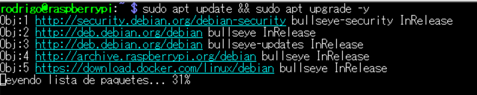

### Imagen 2 - Página 1

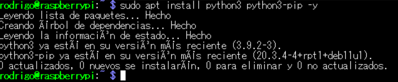

### Imagen 3 - Página 1

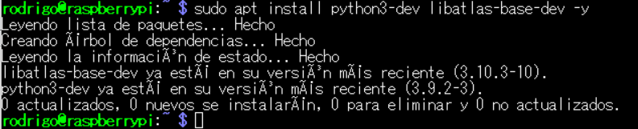

### Imagen 4 - Página 1


### Imagen 5 - Página 1


### Imagen 6 - Página 1

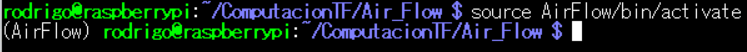

### Imagen 7 - Página 1

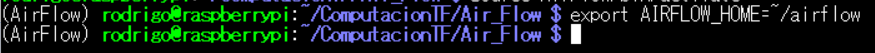

### Imagen 8 - Página 2

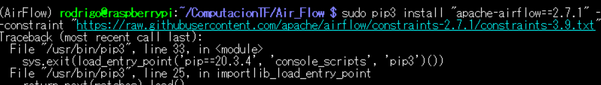

### Imagen 9 - Página 2

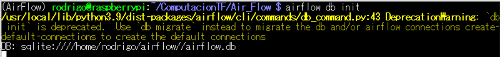

### Imagen 10 - Página 2


### Imagen 11 - Página 2


### Imagen 12 - Página 2


### Imagen 13 - Página 2

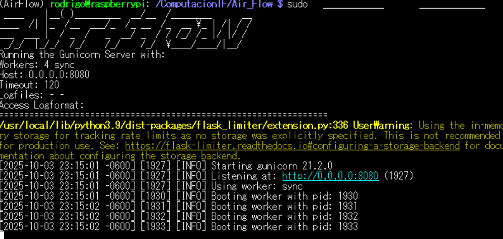

### Imagen 14 - Página 3

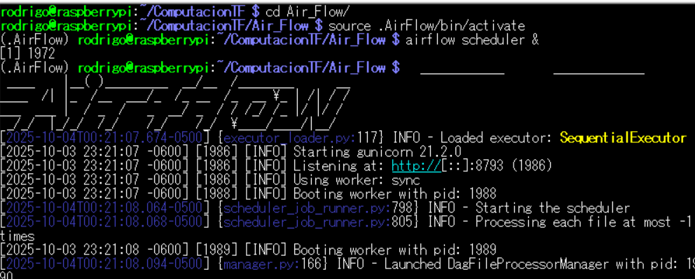

### Imagen 15 - Página 3

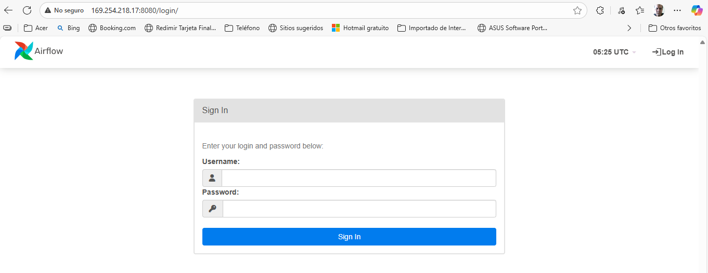

### Imagen 16 - Página 3

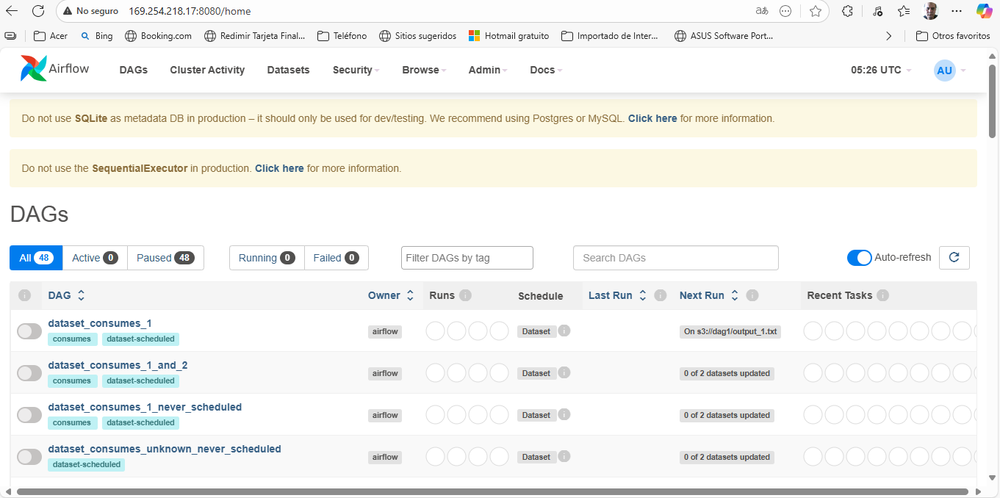


## 🔧 **Solución de Problemas Comunes**

### **Error de memoria insuficiente**
```bash
# Aumentar swap
sudo dphys-swapfile swapoff
sudo nano /etc/dphys-swapfile
# Cambiar CONF_SWAPSIZE=1024
sudo dphys-swapfile setup
sudo dphys-swapfile swapon
```

### **Dependencias faltantes**
```bash
# Instalar dependencias del sistema
sudo apt-get update
sudo apt-get install -y python3-dev libffi-dev libssl-dev
```

## 📝 **Conclusiones**

La instalación de **Apache Airflow** en **Raspberry Pi 3** es una excelente manera de:

- **🎓 Aprender** conceptos de orquestación de workflows
- **💰 Crear** un entorno de desarrollo económico
- **🔬 Experimentar** con pipelines de datos
- **🏠 Implementar** soluciones self-hosted

### **🎯 Beneficios Logrados:**
- ✅ **Entorno funcional** de Airflow en hardware ARM
- ✅ **Configuración optimizada** para recursos limitados
- ✅ **Base sólida** para proyectos de automatización
- ✅ **Conocimiento práctico** de deployment en dispositivos IoT

<div align="center">

---

### 🎯 **¡Dale una estrella si te ayudó esta guía!** ⭐

**Creado con ❤️ para la comunidad Raspberry Pi y Apache Airflow**

</div>
