<h1 align="center">#Practica 05 - instalación de Docker</h1>

## Instalación de Docker en WSL Debian 12
°Primero instale WSL Debian desde Powershell

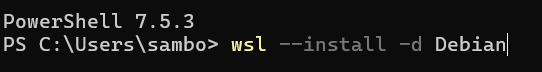

°Reinicie el equipo para completar la instalación
°Realice la configuración inicial de WSL Debian, donde se pedira crear un Usuario y un Password
°Acutualice su entorno usando:
    sudo apt update && sudo apt upgrade -y

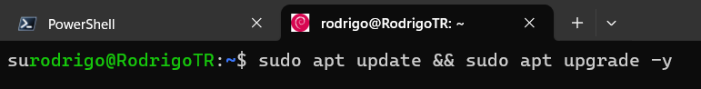

Se le pediran la contraseña que haya creado para el usuario.
Ahora esta listo para instalar Docker en WSL Debian
Comienze descargando el script que automatiza el proceso:
    curl -sSL https://get.docker.com | sh

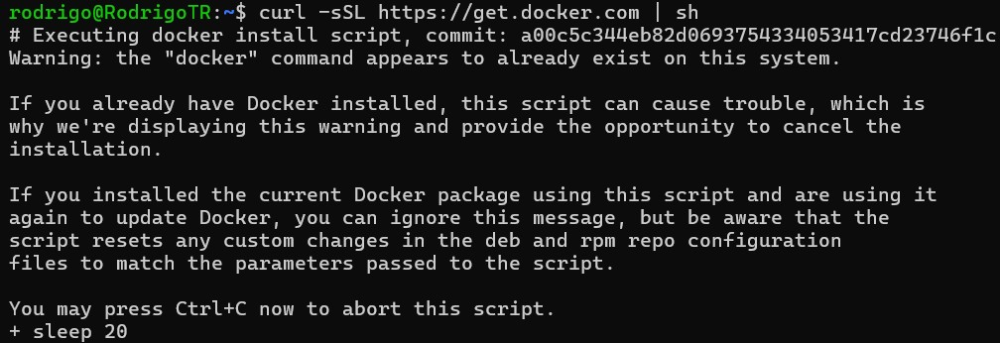

Puede ver el contenido del script de instalación en la carpeta de Documentos del Repositorio bajo el nombre getDocker.

Una vez instalado otorgar permisos al usuario para que pueda ingresar a la ejcución del contendor
     sudo usermod -aG docker <ususario>

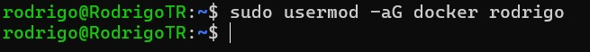

## Uso de Docker
 Una vez instalado Docker, hay que correr una imagen de prueba, el clasico Helloworld, comienze descargando la imagen:
    docker pull hello-world

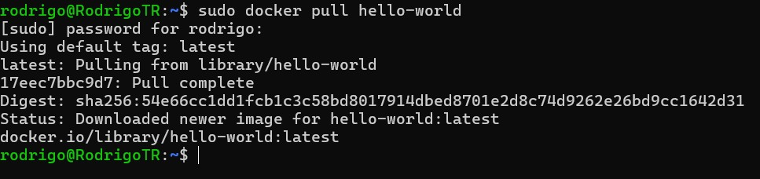

Verifique la imagen se halla descargado correctamente y se liste en el repositorio local de Docker:
    docker images
Como podemos ver la imagen fue descargada correctamente:
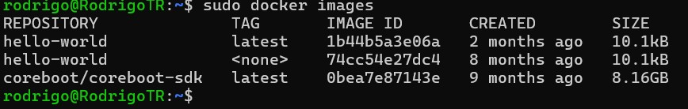

Ejecute la imagen usando el comando:
    docker run hello-world

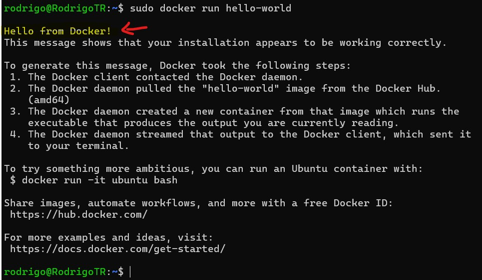

Veremos el mensaje "Hello from Docker!" significa que la instalación se realizó correctamente.

## Ejemplo de ejecución de un contenedor
Mostraremos un ejemplo del uso de contenedores en una raspberry pi ya que Docker es util para generar ambientes de trabajo homogeneos, descargue el siguiente contenedor:
    sudo docker pull tonistiigi/binfmt

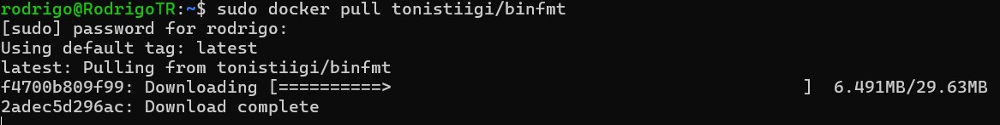

Nos permite emular una arquitectura de computadora especifica para un contenedor, esto permite que a los contenedores ejecutarse como si estuvieran en una maquina virtual la cual es diferente del sistema Host Nativo. Lo cual es muy util para realizar compilaciones cruzadas.
El siguiente comando lanza el contendor con todas las arquitecturas que pueden emularse activas para usarse con los contenedores:
    docker run --privileged --rm tonistiigi/binfmt --install all
Generando una lista de las arquitecturas y emuladores disponibles:
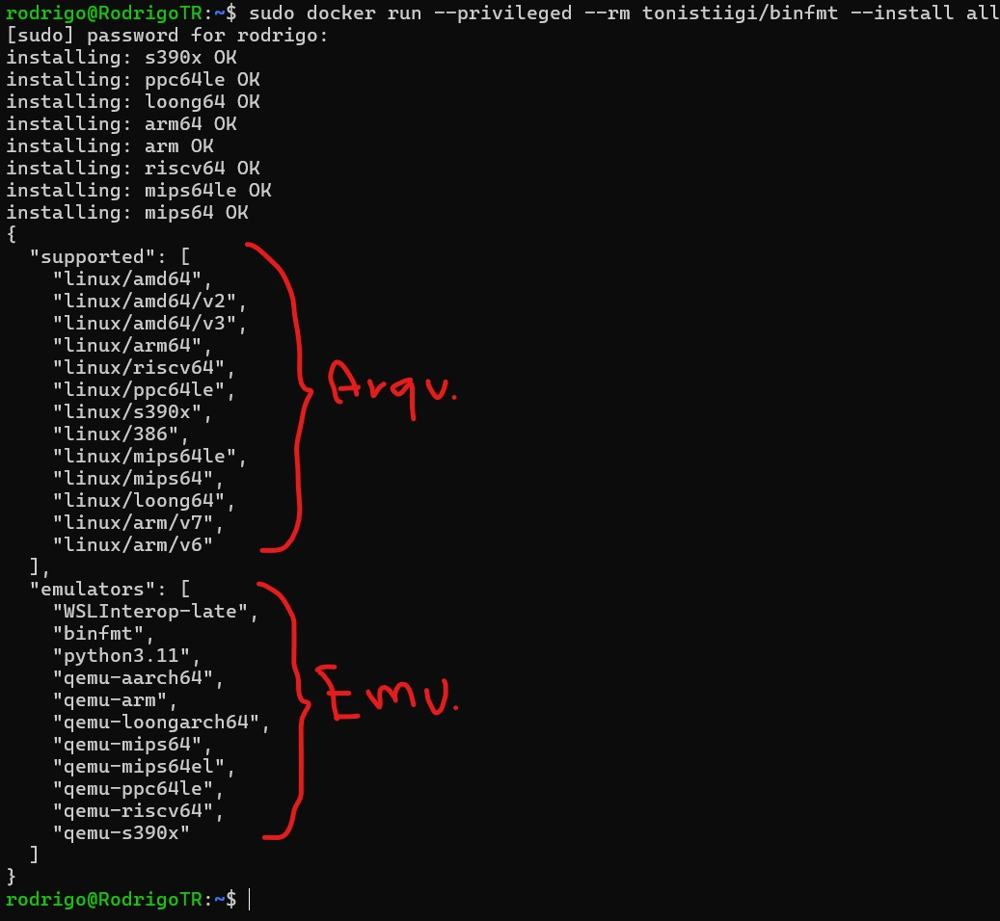

Para probar nuestro nuevo ambiente necesitamos un contenedor que ejecutar, descargamos una version de SDK para Coreboot:
     sudo docker pull coreboot/coreboot-sdk
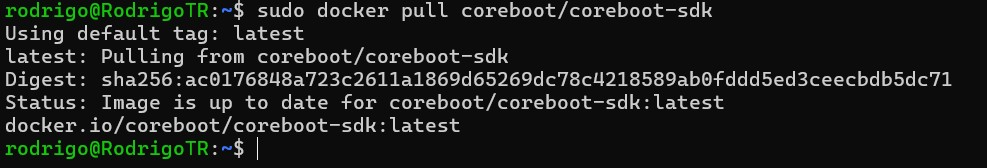

Primero verificamos el tipo de maquina en el que se ejecuta la sesion:
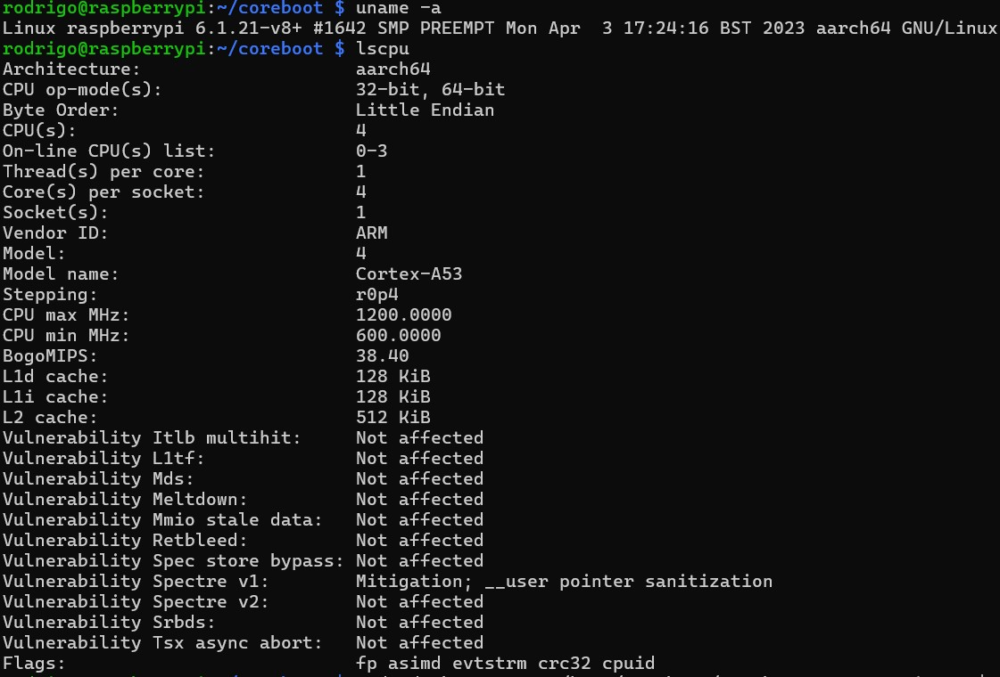

Corremos el contenedor:
    sudo docker run -w /home/coreboot/coreboot -u root -it -v $PWD:/home/coreboot/coreboot --rm --platform linux/amd64 coreboot/coreboot-sdk /bin/bash
y verificamos la arquitectura y el tipo de maquina:
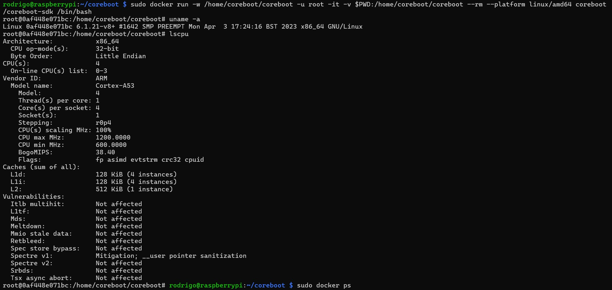

Salimos del contendor con la combinacion de teclas CTRL + P + Q para verificar la ejecución del contenedor con:
    sudo docker ps
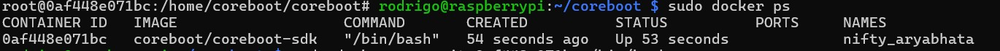 
Salimos del contenedor nuevamente pero ahora usando:
    exit
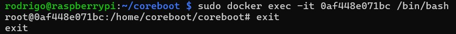
Verificamos que el contenedor sigue en ejecución:
    sudo docker ps
Así que lo detenemo mediante su CONTAINER ID:
    sudo docker stop 0af448e071bc
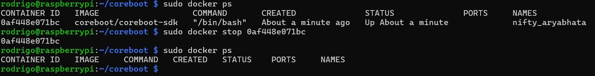
Hemos comprobado como Docker nos ayuda a crear un ambiente homogeneo para nuestras aplicaciones, en el ejmemplo anterior tenemos que las herramientas de Coreboot deben compilarse en un sistema X86, pero la raspberry es ARM, por lo que el contendor nos ayuda a emular un ambiente X86 donde poder compilar nuestro proyecto estando en una raspberry pi que es un equipo con arquitectura ARM.

# Conclusiones:

Como vimos anteriormente Docker esta orientado hacia el area de DEVOPS, para enfrentar el problema que enfrentan los programadores y los tester en la creación y prueba de aplicaciones, para que ambos grupos cuenten con equipos homogeneos donde crear y verificar el código de una aplicación y no pierdan tiempo en ponerse de acuerdo en que tipo de ambiente se va a utilizar lo cual ayuda a que se centren más en la creación y prueba de la aplciacion.