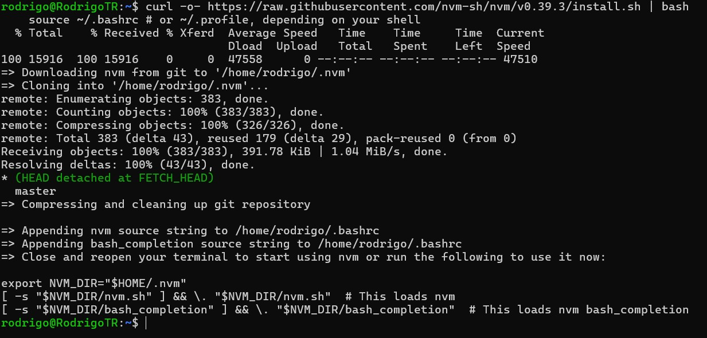
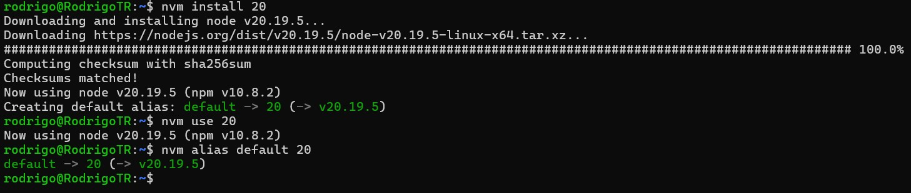
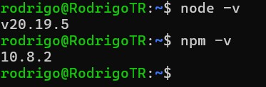
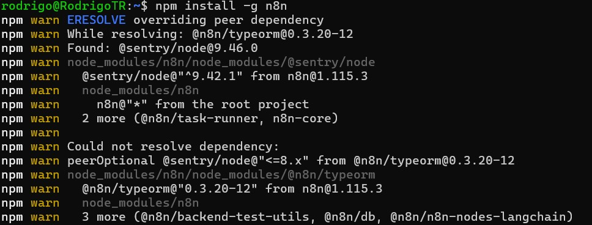
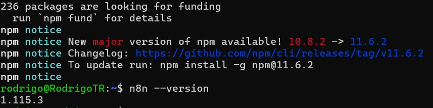
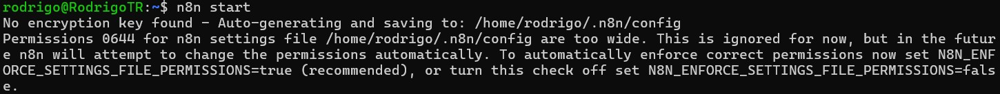
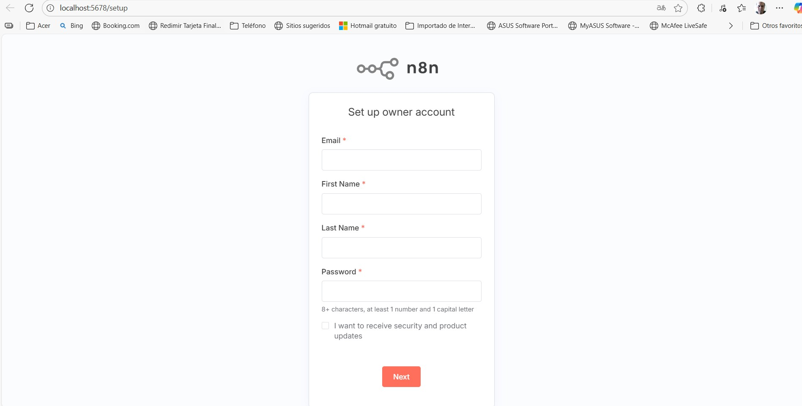
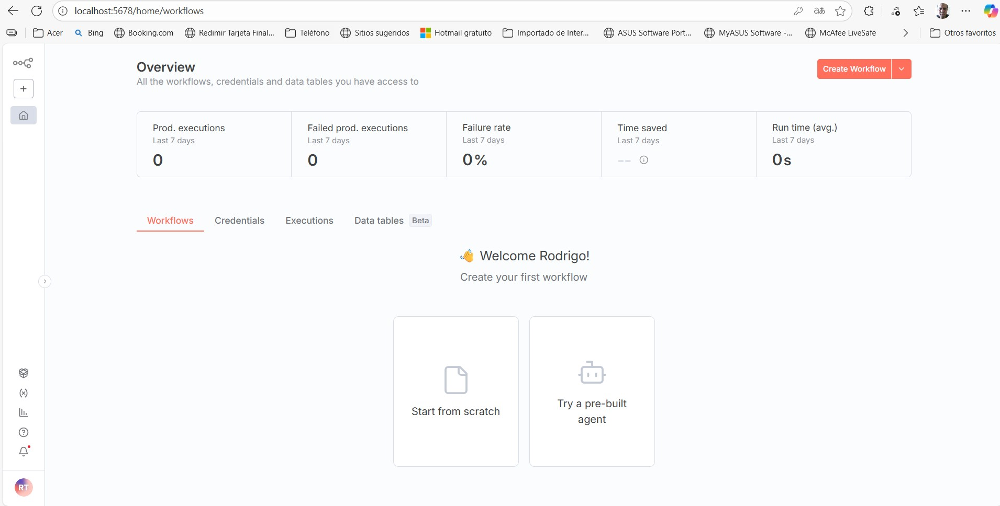

<h1 align="center"># Proyecto primera parte</h1>

### EL LISTADO DE COMANDO PARA INSTALAR LO ENCONTRARA EN LA CARPETA DE DOCUMENTOS COMO n8n_instalacio.txt se muestra el proceso de instalacion para un ambiente WSL Debian 12

## PRIMERO ACTUALICE EL SISTEMA

## INSTALE NODE.JS

use nvm (nodejs version manager)

Revise la instalación

## INSTALAR N8N GLOBALMENTE

Esto tomara algo de tiempo en completarse, algunos paquetes fallaran, pero la instalación continuara sin problemas.
Al terminar verifique la instalación

Incie el servicio n8n

Acceda a la interfaz

Tras completar el proceso de registro estara listo para crear sus Flujos de Trabajo
