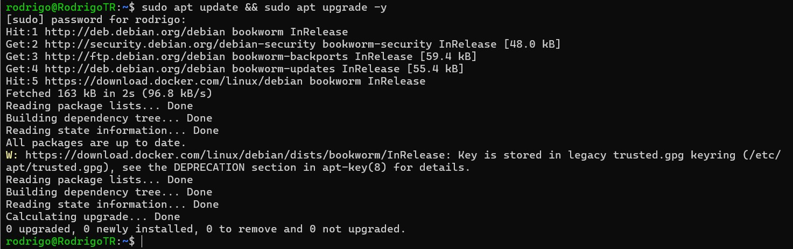
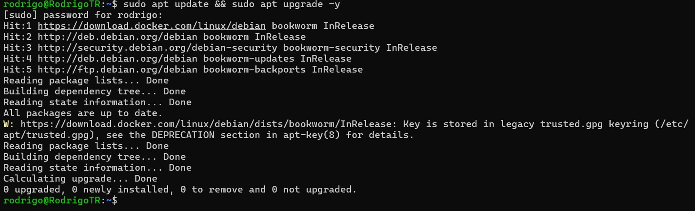
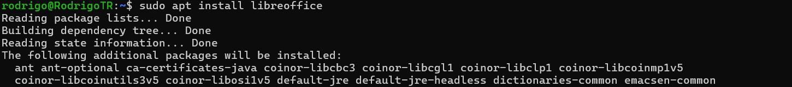
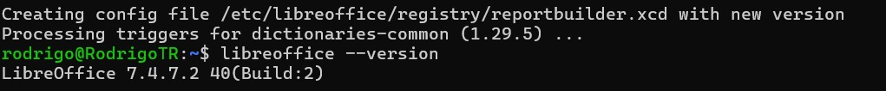
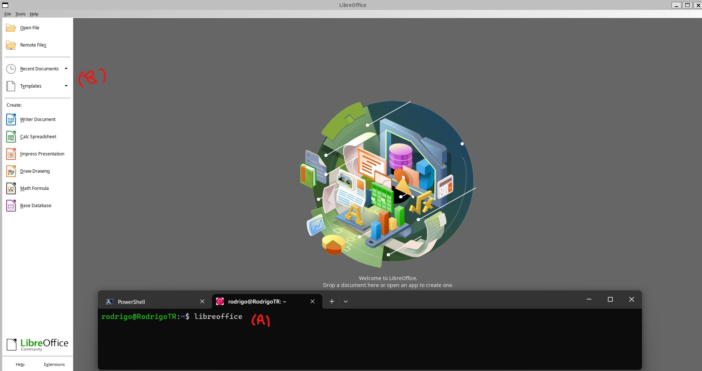

<h1 align="center"># Proyecto primera parte</h1>

### EL LISTADO DE COMANDO PARA INSTALAR LO ENCONTRARA EN LA CARPETA DE DOCUMENTOS COMO n8n_instalacio.txt se muestra el proceso de instalacion para un ambiente WSL Debian 12

## PRIMERO ACTUALICE EL SISTEMA

## INSTALE NODE.JS

use nvm (nodejs version manager)

Revise la instalación

## INSTALAR N8N GLOBALMENTE

Esto tomara algo de tiempo en completarse, algunos paquetes fallaran, pero la instalación continuara sin problemas.
Al terminar verifique la instalación

Incie el servicio n8n

Acceda a la interfaz

Tras completar el proceso de registro estara listo para crear sus Flujos de Trabajo

<h1 align="center"># Instalar LibreOffice</h1>

Utilizaremos la paqueteria LibreOffice para automatizar la conversion de archivos editables docx a pdf.
## Actualizar el sistema:    
    sudo apt update
    sudo apt upgrade

## Instalar el paquete del repo de Debian
    sudo apt install libreoffice

## Verificar la instalacion
    libreoffice --version

## Instalar ambiente de Java (Opcional)
    sudo apt install default-jre
  
## Ejecutar la aplicacion
Escriba el siguiente comando en el terminal como indica (A)

      libreoffice

Podra ver que se ejecuta la GUI del progama 
 

